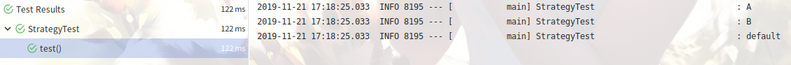

### 策略模式
##### 应用场景
+ 系统需要在多种算法中快速地切换
+ 系统中有一些类仅行为不同
+ 系统中存在多重条件选择语句
##### 实现

###### 接口
```
public interface Strategy {

    default String doSomething() {
        return "default";
    }
}
```
###### 算法具体实现
```
@Component
public class ResourceA implements Strategy {
    @Override
    public String doSomething() {
        return "A";
    }
}
```
...
###### 策略上下文
```
@Component
public class StrategyContext {
    private final Map<String, Strategy> strategyMap = new ConcurrentHashMap<>();

    @Resource
    public void strategyInterface(Map<String, Strategy> strategyMap) {
        this.strategyMap.clear();
        this.strategyMap.putAll(strategyMap);
    }

    public Strategy strategySelect(String mode) {
        Preconditions.checkArgument(!StringUtils.isEmpty(mode), "方法索引不能为空");
        return this.strategyMap.get(mode);
    }
}
```
###### 单元测试
