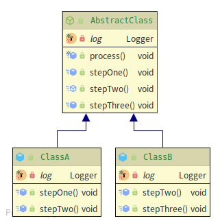
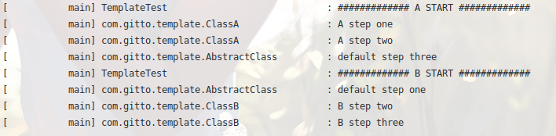

### 模板方法模式
##### 主要思想
+ 定义一个算法流程，将特定步骤的具体实现延迟到子类
+ 在不改变算法流程的情况下，通过不同的子类定制算法流程中的特定步骤
##### 实现

##### 流程抽象类
```
public abstract class AbstractClass {

    /**
     * 申明final 防止子类修改模板执行流程
     */
    public final void process() {
        this.stepOne();
        this.stepTwo();
        this.stepThree();
    }

    public void stepOne() {
        log.info("default step one");
    }

    public abstract void stepTwo();

    public void stepThree() {
        log.info("default step three");
    }
}
```
##### 流程定制
```
public class ClassA extends AbstractClass {
    @Override
    public void stepOne() {
        log.info("A step one");
    }

    @Override
    public void stepTwo() {
        log.info("A step two");
    }
}

public class ClassB extends AbstractClass {
    @Override
    public void stepTwo() {
        log.info("B step two");
    }

    @Override
    public void stepThree() {
        log.info("B step three");
    }
}
```
##### 单元测试
```
    public void test() {
        log.info("############# A START #############");
        new ClassA().process();
        log.info("############# B START #############");
        new ClassB().process();
    }
```
